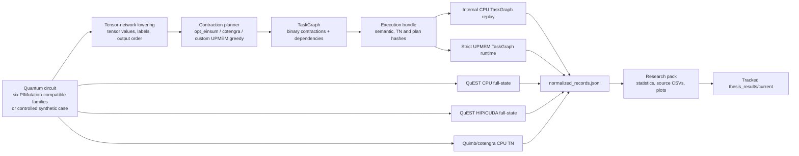
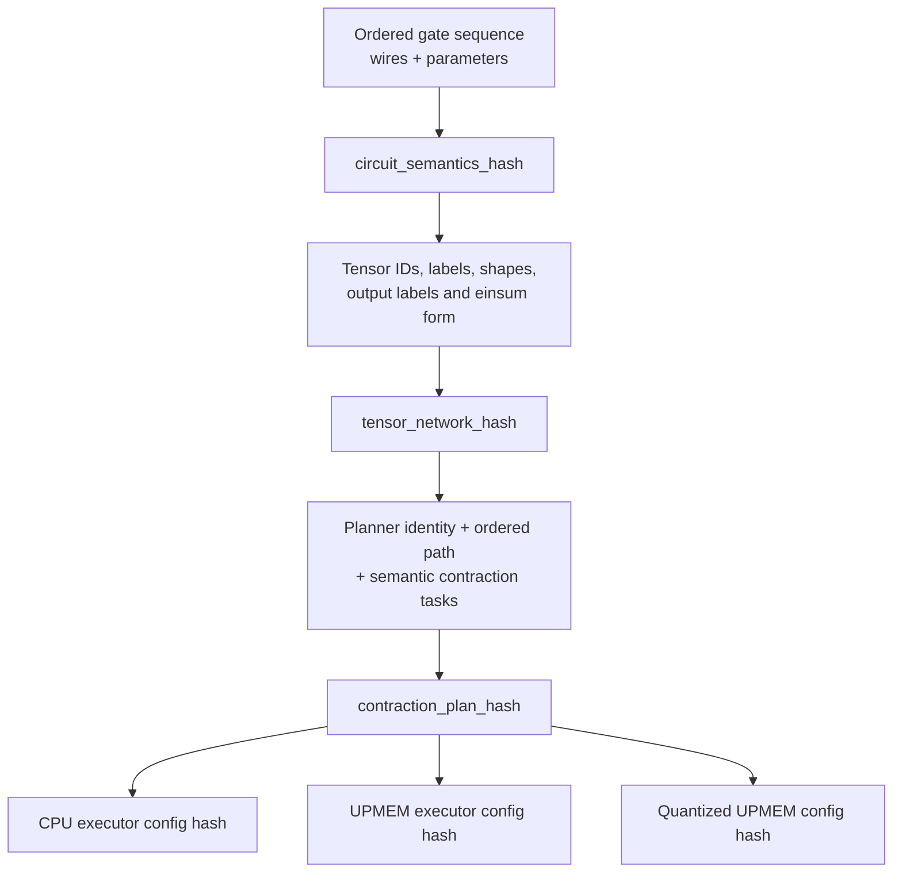
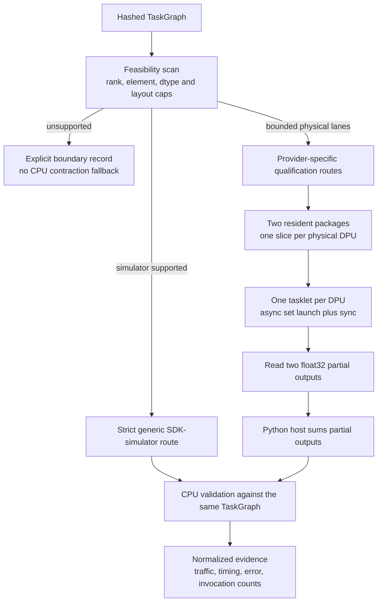

# System Architecture

The accepted current-to-target delivery sequence is maintained in
[`docs/slr_architecture_implementation_roadmap.md`](docs/slr_architecture_implementation_roadmap.md).
This file describes implemented ownership and claim boundaries; the roadmap
defines the M0--M9 research gates and thesis completion criteria.

## Research Objective

The implementation evaluates tensor-network (TN) quantum-circuit simulation on
UPMEM processing-in-memory devices. The immediate objective is not a production
simulator. It is a controlled research system in which circuit semantics,
contraction plans, executor configuration, validation, and measurements remain
separable enough to attribute a result to the component being studied.

The central invariant is:

```text
one circuit semantics + one tensor network + one contraction plan
                         -> multiple explicit executors
                         -> normalized, comparable evidence
```

## End-To-End Data Flow



QuEST and Quimb are independent serious baselines. The internal TaskGraph is the
shared representation used for direct CPU-replay versus UPMEM comparisons. It
is not asserted that a Quimb contraction tree has the same plan as the internal
TaskGraph unless a future adapter proves that identity explicitly.

## Execution Identity

`src/quantum_bench/tn/execution_bundle.py` serializes the scientific identity
of an internal execution:



Executor settings are deliberately excluded from `contraction_plan_hash`.
Thus float32 and int8 UPMEM runs can prove that they execute the same plan while
retaining distinct `executor_config_hash` values. Timings, host paths, and
machine metadata are also excluded from semantic hashes.

`contraction_path_structure_hash` additionally captures only the ordered
pairwise path and lowered task structure. It is useful when two planners carry
different identities or objective settings but select the same structural path.

## Module Ownership

| Layer | Active modules | Responsibility | Status |
| --- | --- | --- | --- |
| Circuit semantics | `thesis/implementation/src/quantum_bench/circuits/` | Deterministic circuit definitions and QuEST-compatible semantic mapping | Active |
| TN lowering | `thesis/implementation/src/quantum_bench/tn/network.py` | Convert ordered gates into tensors, labels, and output convention | Active, thesis infrastructure |
| Planning | `thesis/implementation/src/quantum_bench/tn/planners.py`, `upmem_planner.py`, `upmem_path_cost.py`, `upmem_path_cost_v2.py`, `task_graph.py` | Obtain standard-library or versioned custom modeled paths and lower them into dependency tasks | Active; v1 historical and v2 projected-prefix UPMEM objectives are modeled, not hardware-calibrated |
| Execution identity | `thesis/implementation/src/quantum_bench/tn/execution_bundle.py` | Canonical serialization and SHA-256 identities | Active, thesis contribution |
| Serious full-state baseline | `thesis/implementation/src/quantum_bench/providers/full_state/` + `thesis/implementation/external/QuEST/` | QuEST CPU and verified GPU execution | Active |
| Serious CPU TN baseline | `thesis/implementation/src/quantum_bench/providers/exact_tn/quimb_tn.py` | Quimb/cotengra unsliced and sliced exact TN execution | Active |
| Shared-plan CPU reference | `thesis/implementation/src/quantum_bench/providers/exact_tn/cpu_einsum.py`, `cpu_path_replay.py` | Execute the internal TaskGraph on CPU | Active; diagnostic/reference quality |
| Strict UPMEM runtime | `thesis/implementation/src/quantum_bench/targets/upmem/taskgraph_runtime.py`, `numeric_reference.py`, `runtime_evidence.py` | Execute policy/scheduling while keeping CPU references, validation, and evidence construction reviewable | Active, SDK simulator |
| Physical UPMEM qualification lanes | M2 sliced-resident, M3.1 frontier, M4.2/M4.3/M4.4 routes under `bench/`, `targets/upmem/`, and `native/upmem/simplepim/` | Bounded physical functionality, operator, adapter, and dependency-dispatch qualifications | Declared lanes passed on ETH; separate fixtures, not a general executor; no speedup, energy, scaling, or general-TaskGraph claim |
| Native DPU programs | `thesis/implementation/native/upmem/simplepim/` | Bounded generic loop and resident host/DPU programs | Active, bounded; legacy dense sources are historical and removed from the runnable tree |
| UPMEM analysis | `thesis/implementation/src/quantum_bench/targets/upmem/tile_plan.py`, `schedule.py`, `tn/upmem_path_cost.py`, planner scoring | Estimate transfer, tiling, frontier, assignment pressure, and objective components | Active; execution coverage remains bounded |
| Evidence writer | `thesis/implementation/src/quantum_bench/bench/simulation_backend_compare.py`, `upmem_mvp_benchmark.py` | Run fixed suites and write canonical normalized evidence | Active |
| Derived analysis | `thesis/implementation/scripts/research_benchmark_pack.py` | Statistics, claim guards, source CSVs, and plots | Active |
| Thesis snapshot | `thesis/implementation/scripts/thesis_snapshot.py`, `thesis_runs.py` | Reserved M9 promotion of compact tracked evidence and pruning of stale generated runs | Tooling exists; development evidence is not promoted |

## Route Roles And Claim Boundaries

| Route | Execution | Research role | Permitted claim |
| --- | --- | --- | --- |
| `quest_cpu_full_state_exact` | QuEST CPU | Serious full-state anchor | CPU full-state correctness/runtime under the recorded timing scope |
| `quest_gpu_full_state_exact` | QuEST HIP/CUDA | Serious optional GPU full-state baseline | GPU full-state runtime only when real GPU execution is verified |
| `quimb_tn_exact` | Quimb/cotengra CPU | Serious CPU TN baseline | External exact TN correctness, planning, contraction, and memory proxy |
| `quimb_tn_sliced_exact` | Quimb/cotengra CPU | Slicing evidence | Executed sliced TN reconstruction; current slices use one worker |
| `cpu_tn_einsum_exact` | Internal NumPy TaskGraph | Shared-plan reference/diagnostic | Correct execution of supported internal plans, not a SOTA TN baseline |
| `cpu_tn_path_replay_*` | Internal NumPy TaskGraph | Quantization diagnostic | CPU cost/error of per-contraction replay; not UPMEM performance |
| `upmem_tn_sdk_simulator_quantized` / strict runtime | UPMEM SDK simulator | Bounded PIM code-path evidence | SDK DPU program execution, support boundary, traffic, and error; no hardware speedup |
| `upmem_tn_hardware_sliced_resident_two_dpu` | UPMEM SDK physical hardware | Historical M2 control plus M2.1 useful-slice fixture | The original one-operation control had a zero second partial; the separate M2.1 fixture passed with two useful nonzero slice contributions. Both remain fixed two-DPU functionality lanes with no speedup, energy, scaling, or general-TaskGraph claim |
| `upmem_tn_hardware_taskgraph_resident` | UPMEM SDK physical hardware | Previous bounded one-DPU resident route | Historical one-DPU correctness surface; not the current M2 route |
| `planner_candidate_model` | Host planning/model | Path candidate evidence | Standard objectives plus deterministic custom UPMEM-aware greedy selection; modeled only, no execution speedup |

Full-state correctness and performance are separate tiers. `full_dump` rows can
support exact statevector comparison under their cap. `state_output_mode=none`
rows are `metrics_only` and may support compute timing, but not full-output
exactness claims.

## UPMEM Architecture

### Current Executed Paths



The planner and tile model expose bounded generic single-DPU
MRAM-resident/WRAM-tiled plans. The strict simulator route proves the native SDK
control path but not hardware speedup. The implemented M2 physical route is
narrower: it restricts the terminal contraction of a one-qubit, one-operation
real-valued X/H/Z circuit to two independent contraction-index slices, assigns
one slice to each of exactly two physical DPUs, launches the DPU set
asynchronously, synchronizes once, and reconstructs the result by summing the
two float32 partial outputs in Python. The fixed suite and evidence contract
are documented in the [M2 runbook](docs/upmem_hardware_sliced_resident_mvp_runbook.md).
Shapes outside those boundaries remain explicit failures. The M3.1 frontier and
M4.2--M4.4 SimplePIM results add physical qualifications for dependency-safe
dispatch, a SimplePIM operator, a TaskGraph-derived adapter, and a fixed
resident operator chain. They do not share one native general executor yet.

M4.5 is implemented and physically accepted for bounded functionality as a
descriptor-driven shared runtime. Its evidence terminology uses
`bounded_taskgraph_executed` plus
explicit runtime, kernel, numeric, placement, and communication providers. The
ambiguous `task_graph_integrated` field is not a general scientific claim for
this phase. One resident package is shared by separate one-DPU sequential and
two-DPU frontier schedules. SimplePIM supplies bounded management/allocation
and qualified operator APIs; the thesis-owned resident generic contraction
kernel supplies TaskGraph compute; host-mediated transfer is the initial communication provider.
It is host-mediated handoff only; no direct DPU-to-DPU communication is claimed.
Each session validates one final output, with warmups and repetitions recorded
separately. PID-Comm is the future communication provider,
while ATiM and SparseP are future generated-dense and sparse kernel providers.
M4.5 physical functionality acceptance passed on ETH. The run used one shared
resident package with separate one-DPU sequential and two-DPU frontier
schedules, executing 3 and 2 waves respectively. The two-DPU schedule used one
host-mediated handoff per execution; both placements completed without
simulator or CPU fallback and passed final CPU-reference validation. The
tracked evidence capsule is
[thesis_results/physical_simplepim_taskgraph_m4_5](thesis_results/physical_simplepim_taskgraph_m4_5).
This is bounded functionality evidence only. It provides no timing, speedup,
scaling, energy, or general tensor-network performance claim.

M2 implementation status: the bounded useful-slice acceptance passed on ETH.
M2.2 and M2.3 additionally provide physical float32/requantized and
two-path/two-numeric-mode evidence. M2.3 executed two candidate paths on one
fixed 1q route; it does not prove that either planner optimized physical
execution or selected the fastest path. M3.1 provides dependency-safe
three-task, two-wave dispatch on two DPUs. These results do not establish
speedup, energy, scaling, or general TaskGraph coverage.

Current limitation:

> The M2 two-DPU sliced-resident foundation/MVP exists. Terminal contractions in
> larger graphs, a shared descriptor-driven executor, multi-tasklet execution,
> specialized kernels, unrestricted layouts, communication collectives, and
> general distributed TN execution do not yet exist.

### Target Modular Architecture

| Planned module | Purpose | Current state | Candidate source/inspiration |
| --- | --- | --- | --- |
| UPMEM-aware path objective | Score FLOPs, peak intermediate size, host/DPU and MRAM/WRAM movement, tiles, synchronization, and numerical pressure | Deterministic custom greedy planner plus standard baselines; planner model remains single-DPU, while M2 uses a separate fixed two-slice policy | Thesis contribution on top of `opt_einsum`/cotengra |
| Kernel classifier/selector | Choose generic tiled contraction, permutation/layout, sparse, or collective path | Generic/tile planning primitives exist; specialized selection remains future work | Thesis architecture |
| Tiled generic contraction | Stream operands/output through MRAM/WRAM under explicit caps | Implemented for bounded output tiling; strict generic coverage remains capped | UPMEM programming model; legacy external references are historical |
| Gate-aware permutation kernels | Replace arithmetic by row/index permutation for gates where mathematically valid | Missing | PIMutation-inspired specialization, thesis adaptation to TN tasks |
| Layout/transpose/slicing kernels | Avoid host materialization and enable bounded subproblems | Missing | Standard TN/PIM techniques; implementation is thesis work |
| Quantization formats | Compare same-plan float32 and integer execution with explicit scale/error | Float32 and int8 generic modes exist | Thesis evaluation; motivated by weak DPU floating point |
| Multi-DPU scheduler | Assign ready contractions/tiles to DPU groups | M2 has fixed slice-to-DPU ownership only; general scheduling remains future work | Thesis architecture |
| DPU communication layer | Move intermediates, tiles, and partial reductions across DPU groups | M2 uses Python host sum reconstruction; PID-Comm collectives remain a planned central component | PID-Comm |
| High-level PIM adapter | Manage distributed arrays and reuse map/zip/reduce plus host/DPU communication primitives | Bounded physical management/operator lanes and the descriptor-driven M4.5 shared runtime are physically accepted; timing and scaling remain unmeasured | SimplePIM |
| Automatic kernel generation | Generate and tune local tensor contractions, loop orders, tasklet counts, and tiles | Planned central provider for subsequent dense local-kernel milestones | ATiM |
| Sparse kernels | Execute measured sparse-eligible contractions with established formats and load balancing | Planned central provider for subsequent sparse-kernel milestones | SparseP |

The M3/M4 kernel work will extend the conservative MRAM/WRAM-tiled generic
binary contraction with task-specific providers and intra-DPU execution.
Specialized permutation, sparse, and communication kernels should follow only
when a recorded workload class makes their expected benefit testable.

## External Providers And Thesis Contribution

SimplePIM, PID-Comm, ATiM, and SparseP are central components of the target
architecture, not optional curiosities. SimplePIM now has bounded physical
management/operator qualification, while PID-Comm, ATiM, and SparseP remain
subsequent components. Each serves a task-specific
provider, kernel, or communication boundary; they are not interchangeable
runtimes, and qualification or use of one provider does not imply that it
handles every contraction or route. The generic SDK path remains the explicit
control route; M4.5 adds the physically accepted bounded shared executor with
host-mediated handoff. Its ETH evidence is functionality-only and does not
support timing, speedup, scaling, energy, or general TN performance claims.

| Item | Provenance | How it is used here |
| --- | --- | --- |
| QuEST | External submodule | Full-state CPU and GPU baseline; no thesis ownership claim |
| Quimb, cotengra, opt_einsum | External Python libraries | Serious CPU TN execution and path planning |
| UPMEM SDK | External platform/toolchain | Strict simulator route and bounded two-DPU sliced-resident physical M2 route at ETH |
| SimplePIM | External pinned repository | Bounded physical management/operator qualification exists for M4.2--M4.4; M4.5 uses it for management/allocation while thesis code supplies resident contraction |
| PID-Comm | External pinned repository | Task-specific target for multi-DPU relocation and collective reduction; not claimed as current executor integration |
| ATiM | Official artifact to be pinned | Task-specific target for generated/autotuned dense local tensor kernels; qualification required before integration |
| SparseP | External project to be pinned | Task-specific target for sparse formats, kernels, and load balancing; qualification required before integration |
| PIMutation | Prior research and benchmark inspiration | Six circuit families, full-state PIM comparison context, quantization/specialized gate-operation motivation |
| Circuit-to-TN TaskGraph, strict fallback rules, execution identities, UPMEM-aware evaluation | This thesis implementation | Engineering/research contribution to be evaluated; novelty claims remain bounded by experiments |

PIMutation simulates state vectors on PIM. This thesis changes the execution
object to a TN contraction plan. The comparison to PIMutation is therefore
relative and methodological: shared circuit families and a QuEST full-state
anchor are used to explain where TN changes memory and work. It is not presented
as a direct rerun of PIMutation on identical hardware.

## Evidence And Artifact Boundaries

```text
runs/evidence/      generated executions; ignored by Git
runs/comparisons/   generated derived analysis; ignored by Git
thesis_results/     selected compact evidence, source CSVs and plots; tracked
build/              generated native/cache output; ignored by Git
```

An evidence run may contain manifests, environment metadata, normalized rows,
execution bundles, summaries, and bounded case/task artifacts. Derived plots and
comparison tables are forbidden in evidence. `thesis_results/current` includes
checksums and enough normalized evidence to regenerate its report without
rerunning a simulator.

During M0--M8, development evidence remains in ignored `runs/` directories and
is not promoted to `thesis_results/`. The tracked snapshot surface is reserved
for reviewed final evidence after M9; existing tracked material remains
historical context until then.

Final performance runs require an explicit physical-core count. The workflow
sets and records OpenMP, OpenBLAS, MKL, and NumExpr thread counts, and captures
the active CPU affinity, frequency governor, and NumPy BLAS implementation.
Tables report repeat dispersion as quartiles/IQR in addition to medians.

Provenance has three explicit stages: benchmark source, report generation, and
snapshot promotion. All selected evidence must share one clean implementation
source commit. Repository-wide dirtiness is retained as context, but files
outside `thesis/implementation` do not invalidate the implementation-scoped
source check.

## Modeled Planner And Report Contract

Planner objective versions are preserved rather than silently rewritten. The
existing `upmem_path_cost_v1` suites are historical v1 evidence. V1 evaluates
the fixed `generic_single_dpu_float32_v1` policy, and complex quantum tensor
networks remain standard-planner baseline evidence with modeled UPMEM
infeasibility under that contract.

The additive v2 suites use `custom_upmem` with
`objective_version: upmem_path_cost_v2` and
`selection_scope: projected_prefix`. V2 is a deterministic greedy planner: at
each step it scores the already selected prefix plus each candidate, so it does
not claim a globally optimal complete path. Its
`PathCostComponentsV2` records modeled FLOPs, largest tensor bytes,
split-complex component invocations and recombination, host payloads, modeled
MRAM/DMA windows, tile iterations, host completion events, and explicit memory
assumptions. Those assumptions distinguish logical task payload, fixed native
MRAM reservation, total configured MRAM capacity, maximum per-buffer payload
ratio, known static WRAM bytes, and configured WRAM budget. They are modeled
capacity fields, not measured DPU occupancy. Infeasible steps carry explicit
rejection reasons.

The v2 numeric contract accepts real inputs and complex-typed inputs with zero
imaginary values as real-valued work. Nonzero complex inputs are represented as
split real/imaginary components and are modeled where the bounded policy
supports them. This is a modeled numeric/execution-policy contract, not a claim
that every arbitrary complex layout or workload is executable.

`configs/suites/diagnostics/planner_objective_motifs.yml` and the v2 manual
planner suites contain controlled real-valued chain, tree, star, cycle, grid,
and FLOP/memory trade-off networks. They exist only to test the modeled
objective. Their records are marked `not_real_quantum_circuit=true` and must
never be used as circuit runtime or UPMEM hardware evidence.

Both v1 and v2 planner rows are evidence of path selection and modeled cost
components only. Neither version supplies a UPMEM hardware performance claim;
SDK-simulator or physical timing requires a separate executor route and an
explicitly recorded execution mode.

Derived figures always remain in the report surface. A figure with no valid
data, no variance, or no implementation is emitted as a visible TODO PNG and
is marked `generated_todo_*` in `plot_manifest.json`; it is listed separately
from valid scientific figures. Plot captions identify measured values,
planner-estimated values, modeled values, software-recorded SDK bytes, SDK
simulator timing, or physical-hardware timing as appropriate.

## Scientific Safety Rules

- A matching case name is insufficient: same-plan claims require matching
  circuit, TN, and contraction-plan hashes.
- Planning and execution timings are reported separately.
- CPU/GPU speedup uses matched repeats and identical timing/output contracts.
- Quimb and internal TaskGraph timings are different implementation families;
  they are not silently treated as same-plan speedup.
- UPMEM SDK simulator timing is never hardware speedup.
- Modeled DPU assignment or pressure is never labeled executed parallelism.
- Unsupported rows remain in tables; they define the architecture boundary.
- Energy remains unavailable unless a real sensor interval is measured and its
  source is recorded.
