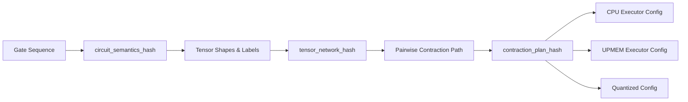

# Comprehensive Audit: Thesis Implementation vs. Scoping Literature Review (SLR)

> **Audit Date:** August 11, 2026 *(Updated with M4.6/M5 development acceptance)*
> **Target Repository:** [implementation](file:///home/tom/repos/Masters/thesis/implementation)  
> **Source Base (SLR PDF):** [Scoping Literature Review Thesis.pdf](file:///home/tom/repos/Masters/thesis/Scoping%20Literature%20Review%20Thesis.pdf)  
> **Test Suite Status:** See current CI; this audit intentionally does not pin a stale test count.
> **Latest Tracked Physical Capsule:** [thesis_results/physical_simplepim_taskgraph_m4_5](file:///home/tom/repos/Masters/thesis/implementation/thesis_results/physical_simplepim_taskgraph_m4_5) *(ETH Physical Acceptance Passed)*

---

## 1. Executive Summary & Context

The Master's thesis investigates accelerating **Tensor-Network (TN) Quantum Circuit Simulation** using **Processing-in-Memory (PIM)** architectures, specifically UPMEM DPU hardware.

### 1.1 SLR Base Findings
The Scoping Literature Review mapped evidence across three proxy tiers because **zero direct studies** existed at the strict target intersection of *Tensor-Network Quantum Simulation on UPMEM-style PIM*:
* **Tier 1 (Quantum Simulation on PIM):** State-vector-focused simulation on PIM (e.g., PIMutation).
* **Tier 2 (TN Contraction & Slicing):** Contraction-path planning, slicing, and memory-capped execution on conventional CPU/GPU/distributed architectures (e.g., `opt_einsum`, `cotengra`, Quimb).
* **Tier 3 (Digital PIM Proxy Workloads):** UPMEM proxy workloads including dense/sparse GEMM/SpMV, graph processing, communication frameworks (PID-Comm), productivity models (SimplePIM), autotuned kernels (ATiM), and sparse formats (SparseP).

### 1.2 Core Thesis Research Question
> *"Can quantum-circuit tensor-network contraction be mapped to UPMEM PIM in a way that is correct, measurable, and eventually faster on real DPU hardware?"*

### 1.3 Current Implementation Maturity & Latest Physical Results
The codebase is an active, highly disciplined **research system**. It establishes:
1. Deterministic circuit-to-TaskGraph lowering with cryptographic hashing invariants.
2. Serious CPU (QuEST full-state, Quimb/cotengra TN, internal NumPy replay) and GPU (QuEST HIP/CUDA) baselines.
3. Bounded UPMEM SDK-simulator execution for generic TaskGraph paths.
4. Physical UPMEM hardware qualification lanes (M2.1, M2.2, M2.3, M3.1, M4.2–M4.4) passed on real ETH hardware.
5. **M4.5 current baseline:** The descriptor-driven shared runtime has passed **ETH physical acceptance** (tracked in `thesis_results/physical_simplepim_taskgraph_m4_5/`). It is the current accepted SimplePIM-managed baseline and remains bounded functionality evidence.

The authoritative current milestone status is in [README.md](README.md#current-milestone-status). M4.1--M5.2 have bounded physical development acceptance; M4.6 passed the 1/2/4/8/16 tasklet sweep with 1680 validated rows, M5.1 passed bounded output partitioning, and M5.2 passed bounded host-mediated contracted-axis reduction. These are not final thesis results, general distributed TN evidence, or performance/scaling claims. M5.3 PID-Comm is blocked before allocation under ETH SDK 2023.1. See [docs/m4_m5_physical_acceptance.md](docs/m4_m5_physical_acceptance.md) for commands and run IDs.

---

## 2. SLR Design Implications vs. Codebase Implementation Audit

Section 9.1 of the SLR outlines six major literature-derived implementation principles for PIM-aware tensor-network simulation. Below is the detailed audit matching each implication to the codebase implementation.

| SLR Implication (Section 9.1) | Codebase Implementation Status | Target Files & Key Evidence | Audit Findings & Assessment |
| :--- | :--- | :--- | :--- |
| **1. Separate Global Planning from Local Execution**<br/>Host handles path search, slicing, layout planning, and global scheduling; DPUs execute assigned local tensor tasks. | **Fully Implemented** | • [upmem_planner.py](file:///home/tom/repos/Masters/thesis/implementation/src/quantum_bench/tn/upmem_planner.py)<br/>• [task_graph.py](file:///home/tom/repos/Masters/thesis/implementation/src/quantum_bench/tn/task_graph.py)<br/>• [upmem_path_cost_v2.py](file:///home/tom/repos/Masters/thesis/implementation/src/quantum_bench/tn/upmem_path_cost_v2.py) | **COMPLETE.** Contraction-path planning, slicing decomposition, and TaskGraph generation are strictly host-side (`opt_einsum`/`cotengra` + custom greedy planner). DPUs receive low-level binary descriptors or fixed task assignments. |
| **2. Use Operation-Specific Execution Routes**<br/>Differentiate dense contraction, permutation/row-swapping, elementwise/diagonal ops, sparse kernels, and collective reductions. | **Partially Implemented & Physically Accepted (M4.5)** | • [router.py](file:///home/tom/repos/Masters/thesis/implementation/src/quantum_bench/routing/router.py)<br/>• [task_routes.py](file:///home/tom/repos/Masters/thesis/implementation/src/quantum_bench/routing/task_routes.py)<br/>• [native/upmem/simplepim/](file:///home/tom/repos/Masters/thesis/implementation/native/upmem/simplepim/) | **IN PROGRESS.** Task classification and routing interfaces exist (`TaskRoute`, `KernelPlan`). SimplePIM operator lanes (M4.2–M4.4) and descriptor-driven M4.5 shared runtime are physically accepted on ETH. Specialized gate-permutation kernels and external providers (ATiM for dense tuning, SparseP for sparse) are planned in M1/M3 but remain unintegrated in native C. |
| **3. Optimize Data Movement (Host-DPU & MRAM-WRAM)**<br/>Host-DPU transfers ($B_{\text{host-DPU}}$), MRAM-WRAM movement ($B_{\text{MRAM-WRAM}}$), and sync ($N_{\text{sync}}$) are primary design constraints alongside FLOPs. | **High Alignment (Planner & Physical M4.5)** | • [upmem_path_cost_v2.py](file:///home/tom/repos/Masters/thesis/implementation/src/quantum_bench/tn/upmem_path_cost_v2.py#L76-L130)<br/>• [tile_plan.py](file:///home/tom/repos/Masters/thesis/implementation/src/quantum_bench/targets/upmem/tile_plan.py)<br/>• [physical_simplepim_taskgraph_m4_5](file:///home/tom/repos/Masters/thesis/implementation/thesis_results/physical_simplepim_taskgraph_m4_5) | **STRONG ALIGNMENT.** The v2 planner explicitly scores host transfers, MRAM DMA window sizes, WRAM pressure, and host completion events. M4.5 physical evidence tracks application-visible transfers and host-mediated dependency handoffs on 2 DPUs. |
| **4. Design for WRAM-Aware Tiling**<br/>Explicit scratchpad tiling, buffer management, and MRAM$\leftrightarrow$WRAM transfers to fit small DPU WRAM (e.g. 64KB). | **Implemented in Model & Bounded SDK Route** | • [tile_plan.py](file:///home/tom/repos/Masters/thesis/implementation/src/quantum_bench/targets/upmem/tile_plan.py)<br/>• [taskgraph_runtime.py](file:///home/tom/repos/Masters/thesis/implementation/src/quantum_bench/targets/upmem/taskgraph_runtime.py) | **BOUNDED.** Tile planning primitives and output-tiled generic SDK execution exist. Multi-tasklet intra-DPU tiling on physical hardware (M4.6) is the immediate next implementation target. |
| **5. Treat Numerical Representation as a Design Variable**<br/>Evaluate soft-float overhead ($E_{\text{num}}$), test fixed-point, int8/int32, block-floating point, or quantized complex formats. | **Fully Implemented** | • [fixed_point.py](file:///home/tom/repos/Masters/thesis/implementation/src/quantum_bench/formats/fixed_point.py)<br/>• [numeric_reference.py](file:///home/tom/repos/Masters/thesis/implementation/src/quantum_bench/targets/upmem/numeric_reference.py)<br/>• [upmem_quantization_boundary.yml](file:///home/tom/repos/Masters/thesis/implementation/configs/suites/manual/thesis_upmem_quantization_boundary.yml) | **COMPLETE.** Per-task int8/int32 quantization, float32, fixed-point specifications, and split real/imaginary complex representations are implemented and benchmarked in same-plan quantization suites. |
| **6. Avoid Fine-Grained Inter-DPU Dependencies**<br/>DPUs do not communicate directly; plan operations as host-mediated or use framework collectives (PID-Comm). | **Aligned with Hardware Reality** | • [hardware_sliced_resident_session.py](file:///home/tom/repos/Masters/thesis/implementation/src/quantum_bench/targets/upmem/hardware_sliced_resident_session.py)<br/>• [slr_architecture_implementation_roadmap.md](file:///home/tom/repos/Masters/thesis/implementation/docs/slr_architecture_implementation_roadmap.md) | **ALIGNED.** Physical M2 uses Python host partial sum reconstruction. M4.5 uses host-mediated dependency handoffs. PID-Comm is pinned as the multi-DPU collective provider for M5. |

---

## 3. Cost-Model Alignment Audit

Section 9.3 of the SLR proposed a literature-derived first-order cost model:

$$C_{\text{PIM}} \approx \alpha \cdot B_{\text{host-DPU}} + \beta \cdot B_{\text{MRAM-WRAM}} + \gamma \cdot I_{\text{DPU}} + \delta \cdot N_{\text{sync}} + \eta \cdot E_{\text{num}} + \theta \cdot P_{\text{WRAM}}$$

### Codebase Verification: `PathCostComponentsV2`
In [upmem_path_cost_v2.py](file:///home/tom/repos/Masters/thesis/implementation/src/quantum_bench/tn/upmem_path_cost_v2.py#L76-L130), the implementation defines `PathCostComponentsV2` which maps 1-to-1 with the SLR terms:

```python
# Direct 1-to-1 Mapping between SLR Section 9.3 and implementation:
host_to_dpu_payload_bytes + dpu_to_host_payload_bytes  # B_host-DPU
mram_dma_window_bytes_model                            # B_MRAM-WRAM
estimated_flops                                        # I_DPU
host_completion_events                                 # N_sync
numeric_representation_penalty                         # E_num
wram_known_pressure_ratio                              # P_WRAM
```

### Scenario Profiles
The implementation defines six explicit weight profiles:
1. `compute_oriented`
2. `host_transfer_oriented`
3. `local_movement_oriented`
4. `wram_constrained`
5. `synchronization_constrained`
6. `balanced_literature_informed`

> [!NOTE]
> **Audit Finding:** The cost model is fully implemented and tested via `thesis_planner_sensitivity_v2.yml`. However, as documented in `ARCHITECTURE.md`, these weights are currently **uncalibrated scenario assumptions (modeled)**, not physical hardware constants. Calibrating these coefficients against empirical UPMEM microbenchmarks is the explicit goal of **Milestone M8**.

---

## 4. Benchmark Architecture & Scientific Rigor

### 4.1 Execution Identity & Hashing Invariants
The codebase enforces strict scientific guardrails via [execution_bundle.py](file:///home/tom/repos/Masters/thesis/implementation/src/quantum_bench/tn/execution_bundle.py):
* `circuit_semantics_hash`: SHA-256 of ordered gate sequence & parameters.
* `tensor_network_hash`: SHA-256 of tensor shapes, labels, and einsum expressions.
* `contraction_plan_hash`: SHA-256 of planner identity and ordered pairwise contraction path.



> [!IMPORTANT]
> **Scientific Integrity:** Two executions (e.g. CPU NumPy vs UPMEM DPU) are labeled **same-plan** *only* when their `contraction_plan_hash` values match exactly. UPMEM SDK simulator timings are strictly excluded from speedup assertions.

### 4.2 Benchmark Grid
The benchmark matrix ([THESIS_BENCHMARK_MATRIX.md](file:///home/tom/repos/Masters/thesis/implementation/THESIS_BENCHMARK_MATRIX.md)) incorporates:
* **6 Circuit Families:** QRNG, BV, XOR, BB84, EDC, HS (chosen for continuity with PIMutation).
* **7 Local Qubit Sizes:** 8, 10, 12, 14, 16, 18, 20 qubits (42 canonical evaluation cases).
* **Synthetic Motifs:** Chains, trees, stars, cycles, grids, and FLOP/memory trade-offs (`not_real_quantum_circuit=true`) for planner objective stress testing.

---

## 5. Milestone Progression Audit (Roadmap M0–M9)

The thesis roadmap ([docs/slr_architecture_implementation_roadmap.md](file:///home/tom/repos/Masters/thesis/implementation/docs/slr_architecture_implementation_roadmap.md)) establishes a 10-phase delivery plan:

```
  M0: Shared Contracts & Hashing [PASSED]
  ├── M1: Physical Qualification of 4 Providers [IN PROGRESS - SimplePIM probe passed]
  ├── M2: Two-DPU Sliced-Resident MVP [PASSED ON ETH]
  │   ├── M2.1: Useful-slice fixture [PASSED ON ETH]
  │   ├── M2.2: Float32 / Requantized execution [PASSED ON ETH]
  │   └── M2.3: Two-path / Two-numeric-mode execution [PASSED ON ETH]
  ├── M3: Operation-Aware Provider/Kernel System [IN PROGRESS]
  │   └── M3.1: Two-wave frontier dispatch [PASSED ON ETH]
  ├── M4: SimplePIM Operators & Shared Runtime [M4.1-M4.6 BOUNDED PHYSICAL ACCEPTANCE]
  │   ├── M4.1: Bounded physical qualification [ACCEPTED ON ETH]
  │   ├── M4.2: SimplePIM rank1 primitive [ACCEPTED ON ETH]
  │   ├── M4.3: TaskGraph-derived operand adapter [ACCEPTED ON ETH]
  │   ├── M4.4: Bounded two-task persistent chain [ACCEPTED ON ETH]
  │   ├── M4.5: Descriptor-driven shared runtime [CURRENT ACCEPTED BASELINE]
  │   └── M4.6: Intra-DPU tiling, tasklets, timing & profiling [PHYSICAL DEVELOPMENT ACCEPTANCE]
  ├── M5: Distributed Single Large Contraction [M5.1-M5.2 BOUNDED PROBES]
  │   ├── M5.1: Output partition [PHYSICAL DEVELOPMENT ACCEPTANCE]
  │   ├── M5.2: Host-contracted reduction [PHYSICAL DEVELOPMENT ACCEPTANCE]
  │   └── M5.3: PID-Comm [BLOCKED; SDK QUALIFICATION REQUIRED]
  ├── M6: Frontier/Subtree Concurrency [PLANNED]
  ├── M7: Hierarchical Hybrid Parallelism [PLANNED]
  ├── M8: Hardware Calibration of Cost Model [PLANNED]
  └── M9: Final Maintainability & Benchmark Freeze [PLANNED]
```

### 5.1 Status of `thesis_results/physical_simplepim_taskgraph_m4_5`
Milestone **M4.5** has been physically accepted on ETH hardware and committed to `thesis_results/physical_simplepim_taskgraph_m4_5`:
* Source run: `eth-evidence/2026-08-09_22-19-27`
* Source commit: `c7bbf957d17346e819c52fc45ca592c3bcb691ca`
* Features proven: 1-DPU and 2-DPU placement, shared resident package execution, 3-wave & 2-wave scheduling, host-mediated dependency handoffs, exact final output validation against CPU reference ($3.788 \times 10^{-8} < 10^{-6}$).

---

## 6. Synthesis & Key Audit Recommendations

### Summary of Alignment
The thesis implementation demonstrates **exceptional fidelity** to the design guidelines established in the Scoping Literature Review. Key highlights include:
1. **Mathematical Cost Model Rigor:** Direct 1-to-1 translation of Equation 9.3 into `PathCostComponentsV2`.
2. **Methodological Safety:** Strict separation of execution identity, planning timing, simulator timing, and hardware timing.
3. **Hardware Realism & Physical Acceptance:** M4.5 physically accepted on ETH hardware; bounded qualification runs prevent premature claims of speedup.

### Recommended Next Actions
1. **Advance beyond bounded M4/M5 probes**: implement general distributed TaskGraph scheduling, then qualify external communication and kernel providers. The detailed ETH development acceptance record is in `docs/m4_m5_physical_acceptance.md`.
2. **Complete M1 Provider Pinning**: Pin official source releases for ATiM (ISCA '25 artifact) and SparseP (CMU-SAFARI repository) alongside PID-Comm and SimplePIM.
3. **Advance to M5.3/M6**: qualify communication-provider options, then implement general distributed TaskGraph scheduling and multi-DPU execution.
4. **Calibrate Cost Model (M8)**: Execute physical microbenchmarks on UPMEM hardware to empirically calibrate the penalty coefficients ($\alpha, \beta, \gamma, \delta, \eta, \theta$).
5. **Rerun & Promote Snapshot (M9)**: Rerun the research suite (`make thesis-run`), regenerate comparison plots (`make thesis-report`), and promote the updated results into `thesis_results/current`.
