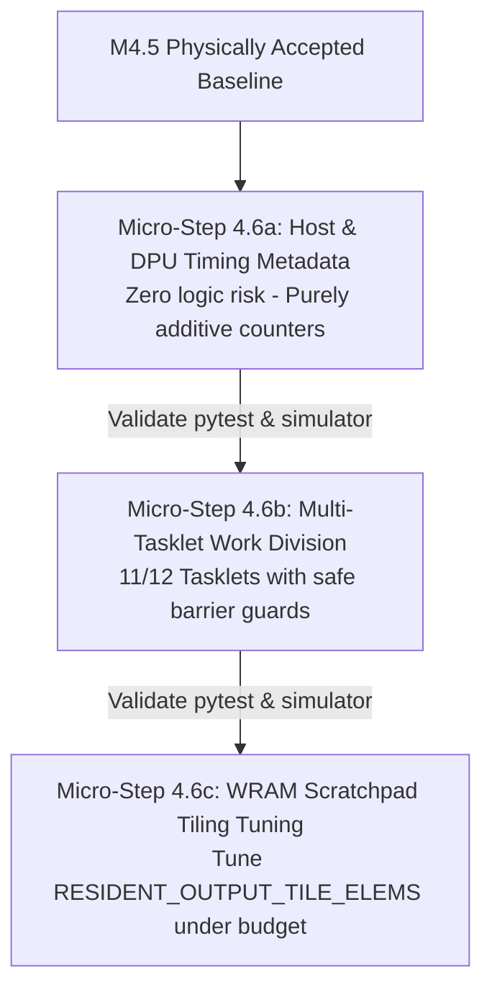

# Critical Audit & Refined Implementation Plan: Milestone M4.6

> **Audit Summary:** The initial draft bundled hardware timing, multi-tasklet execution, and WRAM tiling simultaneously. This violated the project's **KISS principle** (*"Add one capability at a time and validate it locally before combining it"*).  
> Below is the critical failure mode analysis and the **refined 3-stage KISS implementation plan**.

---

## 1. Audit Findings & Potential Failure Modes

### 🚨 Risk 1: Scope Creep & Compound Failure Surface
- **Finding:** Combining `perfcounter` instrumentation, `NR_TASKLETS` strided execution, tasklet barriers, and WRAM tile restructuring into one monolithic step makes root-cause isolation difficult if a bug occurs.
- **KISS Violation:** Violates the roadmap guideline to execute short, vertical, single-capability experiments.

### 🚨 Risk 2: DPU Tasklet Deadlock (Barrier Desynchronization)
- **Finding:** In UPMEM C code, if `operation.output_elements < NR_TASKLETS` or if tasklet work division uses early `return` statements, some tasklets will bypass `barrier_wait(&tasklet_barrier)`.
- **Impact:** Permanent DPU hang or launch timeout during physical execution.

### 🚨 Risk 3: WRAM Stack & Scratchpad Overflow
- **Finding:** UPMEM DPUs allocate 64KB total WRAM shared across instructions, static buffers, and tasklet stack frames. Increasing `NR_TASKLETS` reduces per-tasklet stack space (down to ~1KB–2KB per tasklet). Large local arrays in `dpu.c` can silently corrupt stack memory.

### 🚨 Risk 4: SDK Simulator vs. Hardware `perfcounter` Discrepancy
- **Finding:** `perfcounter_get()` returns physical DPU clock cycles on ETH hardware, but may return simulated cycles or `0` on the UPMEM SDK software simulator if hardware flags are missing.
- **Impact:** Host Python code could throw exceptions if non-zero counters are strictly assumed.

---

## 2. Refined KISS Strategy (3 Sequential Micro-Steps)

To eliminate risks and ensure 100% test suite stability, M4.6 is decomposed into **3 sequential micro-steps**:

---

### Micro-Step 4.6a: Hardware & Host Timing Metadata (Zero Risk)

**Scope:** Add timing instrumentation without touching tasklets or tile math.
- **Host Changes ([hardware_session.py](file:///home/tom/repos/Masters/thesis/implementation/src/quantum_bench/targets/upmem/hardware_session.py)):** Measure `time.perf_counter()` around `dpu_copy_to()`, `dpu_launch()`, `dpu_sync()`, and `dpu_copy_from()`.
- **DPU Changes ([common.h](file:///home/tom/repos/Masters/thesis/implementation/native/upmem/simplepim/upmem_sdk_generic_loop_resident/common.h)):** Add `uint64_t dpu_cycles` to `resident_completion_t`. Read `perfcounter_get()` on single-tasklet DPU execution.
- **Safety Guard:** If `dpu_cycles == 0` (in basic simulator mode), host software sets `dpu_compute_seconds = None` without crashing.

---

### Micro-Step 4.6b: Multi-Tasklet Parallelism (Targeted Parallelism)

**Scope:** Support $1 \le \text{NR\_TASKLETS} \le 16$ with robust barrier safety.
- **DPU Work Division ([dpu.c](file:///home/tom/repos/Masters/thesis/implementation/native/upmem/simplepim/upmem_sdk_generic_loop_resident/dpu.c)):**
  - Use strided output element indexing:
    `for (uint32_t i = me(); i < tile_elems; i += NR_TASKLETS)`
  - Ensure *all* tasklets reach `barrier_wait()` regardless of element count.
  - Keep local stack variables minimal (no large arrays on tasklet stack).

---

### Micro-Step 4.6c: WRAM Scratchpad Tiling Tuning (Locality Optimization)

**Scope:** Tune `RESIDENT_OUTPUT_TILE_ELEMS` to fit WRAM budget under multi-tasklet execution.
- Validate static WRAM footprint stays strictly below 60KB (`known_wram_static_bytes < 60 * 1024`).

---

## 3. SMART Verification & Safety Matrix

| Step | Scope | Verification Command | Success Criteria |
| :--- | :--- | :--- | :--- |
| **4.6a** | Timing Metadata | `make test` | 635 tests pass; `normalized_records.jsonl` contains valid timing fields. |
| **4.6b** | Multi-Tasklet | `PYTHONDONTWRITEBYTECODE=1 PYTHONPATH=src ../.venv/bin/python -m pytest tests/test_upmem_simplepim_taskgraph_executor.py` | 1, 2, 4, 8, 12, 16 tasklets produce identical checksums & outputs as 1 tasklet. |
| **4.6c** | WRAM Tiling | `PYTHONDONTWRITEBYTECODE=1 PYTHONPATH=src ../.venv/bin/python -m pytest tests/test_upmem_tile_plan.py` | WRAM allocation remains $\le 60\text{KB}$; no stack overflow. |

---

## 4. User Review Required

> [!TIP]
> **KISS Conformance:** Decomposing M4.6 into 4.6a, 4.6b, and 4.6c guarantees that each PR/commit adds exactly one capability, can be validated independently locally via `make test`, and eliminates compound debugging risks.
