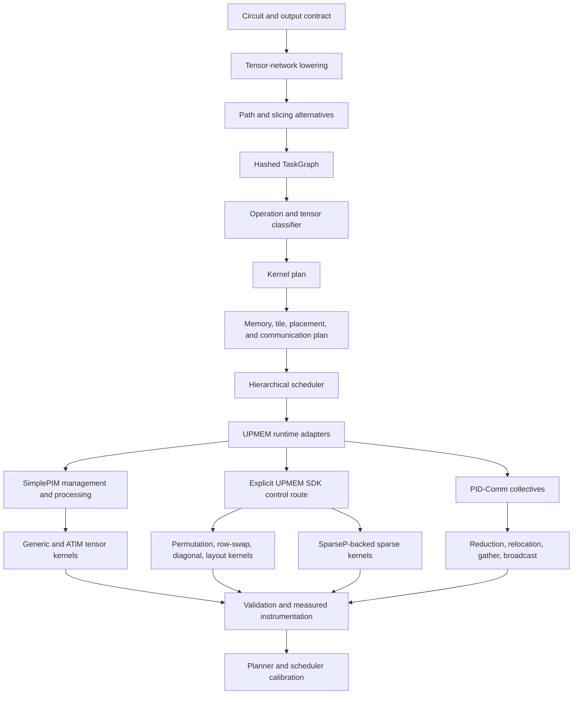

# SLR Architecture Implementation Roadmap

Status: active architecture roadmap, revised 2026-07-27

## Goal

Implement and evaluate the complete research architecture derived from the
Scoping Literature Review:

> A host-planned tensor-network quantum-circuit simulator that maps different
> kinds of tensor work to appropriate UPMEM execution strategies, exploits
> parallelism both between contractions and within large contractions, retains
> useful data near DPUs, and treats communication, numerical representation,
> and kernel choice as first-class planning decisions.

The current bounded UPMEM routes are starting points for this system. They are
not the intended final architecture and their development measurements are not
results to publish now.

During architecture development, benchmark records are engineering feedback:
they show whether a component is correct, where time is spent, and what to
build next. Development evidence remains in ignored run directories and is not
promoted now. Final thesis evidence is generated only after the architecture
and benchmark questions are sufficiently stable.

## Thesis Contribution

The intended contribution is the architecture and its evaluation:

1. a shared circuit-to-TN-to-TaskGraph representation;
2. a host planner that jointly considers path, slicing, kernel, placement,
   communication, tiling, and numeric representation;
3. a modular UPMEM execution layer built with and on top of existing UPMEM
   systems rather than reimplementing them;
4. two complementary forms of physical parallelism;
5. operation-specific kernels, including calculation-eliding quantum
   operations;
6. a hardware-informed planning objective; and
7. a reproducible comparison against CPU, GPU, and conventional TN baselines.

Positive speedup is a hypothesis, not a requirement. The implementation is
successful if it can explain measured wins, losses, and boundaries using the
architecture's recorded decisions.

## Development Principle

KISS means simple interfaces and short vertical experiments. It does not mean
a small final architecture.

- Reuse SimplePIM, PID-Comm, ATiM, SparseP, opt_einsum, cotengra, Quimb, and
  QuEST where their task-specific responsibilities match.
- Write thesis-owned adapters, planning logic, quantum-aware classification,
  and missing kernels.
- Keep a simple manual kernel and explicit SDK route as the control.
- Add one capability at a time and validate it locally before combining it.
- Keep generated development runs ignored by Git; do not promote development
  evidence now.
- Do not freeze thesis evidence while core architecture is changing.
- Refactor modules when a new architecture boundary needs to be expressed, not
  as a separate beautification project.

## Current State

### Foundation already implemented

| Layer | Current implementation | Maturity |
| --- | --- | --- |
| Circuit semantics | Deterministic builtin circuits and output contracts | Active |
| TN lowering | Explicit tensor/index representation | Active |
| Contraction planning | opt_einsum, cotengra, custom UPMEM planner v1/v2 | Active; custom objective not hardware calibrated |
| TaskGraph | Hashed pairwise tasks with dependencies and execution identity | Active |
| CPU/GPU baselines | QuEST full state, Quimb/cotengra TN, internal CPU replay | Active |
| Slicing/frontier models | Internal slice-aware graph, reconstruction, frontier waves | Implemented on CPU/model surfaces; not active physical execution |
| UPMEM simulator | Strict bounded generic TaskGraph route | Active diagnostic |
| UPMEM hardware | One physical DPU, one tasklet, complete bounded MRAM-resident TaskGraph | Active starting point |
| Numerical modes | Float32, per-task int8/int32, split real/imaginary complex | Active in bounded routes |
| Evidence system | Normalized records, claim guards, reports, plots, snapshots | Active instrumentation |
| External sources | QuEST, SimplePIM, and PID-Comm pinned | QuEST active; SimplePIM/PID-Comm are target providers and are not claimed as current executor integrations |

### Central architecture not implemented

- Parallel execution of independent ready contractions on different DPUs.
- Parallel execution of one large contraction across tasklets, DPUs, ranks, or
  UPMEM DIMMs.
- A hybrid scheduler that uses both forms of parallelism.
- A production kernel classifier and dispatcher.
- ATiM-generated/tuned tensor kernels.
- SparseP-backed sparse execution.
- PIMutation-inspired gate merging, row swapping/permutation, and vector
  partitioning adapted to TN tasks.
- SimplePIM-backed array management and processing routes.
- PID-Comm-backed collectives and data relocation.
- Hardware-calibrated planner weights and schedule selection.
- Physical strong/weak scaling and energy evaluation.

This is therefore an architecture foundation, not a nearly finished system.

## Important Current Defects

### Validation status is overloaded

The physical resident route separately computes policy-reference agreement and
full-precision accuracy, but top-level `validation_status` currently represents
policy/reference execution validity plus transfer consistency. Before several
executors are combined, introduce:

- `execution_contract_status`;
- `policy_reference_status`;
- `full_precision_accuracy_status`; and
- `scientific_validation_status`.

Keep old fields readable, but do not silently reinterpret them.

### Architecture documentation route boundary

`ARCHITECTURE.md` records the bounded simulator and resident physical routes as
current evidence surfaces. The M0--M9 sequence below adds target interfaces
and routes without relabeling modeled or development-only behavior as executed
parallelism.

### Core implementation modules are too concentrated

The current resident target, session runner, benchmark route, and report script
combine responsibilities that will conflict once tasklets, DPUs, kernel types,
and communication plans are added. Their present size is acceptable for
bring-up, but not for the target architecture.

The solution is not a repository-wide refactor. Split them along the target
architecture boundaries as each boundary becomes active.

## Target Architecture



### Host responsibilities

- circuit and TN semantics;
- contraction-path and slicing search;
- task classification;
- numeric-format selection;
- tile and memory planning;
- task/tile/slice placement;
- communication planning;
- global dependency scheduling;
- result reconstruction and validation; and
- benchmark orchestration.

### DPU responsibilities

- local generic tensor contraction;
- local tensor tiles;
- gate/permutation/layout operations;
- sparse kernels;
- local partial reductions;
- data relocation needed by collectives; and
- explicit numeric conversion when assigned by the plan.

The DPU does not perform global path search or dynamically discover the whole
TaskGraph.

## Architecture Plans And Interfaces

The existing `TaskGraph` remains the scientific plan. Execution details should
be additive plans whose hashes do not alter the contraction-plan identity.

### Kernel plan

Each task or expanded task unit records:

- `kernel_kind`;
- `kernel_provider`;
- input/output layouts;
- numeric mode and accumulator mode;
- tasklet partition;
- tile shape;
- eligibility reason;
- fallback kernel; and
- kernel configuration hash.

Initial kernel kinds:

- `generic_binary_contraction`;
- `atim_generated_contraction`;
- `permutation_row_swap`;
- `diagonal_or_elementwise`;
- `reshape_transpose_layout`;
- `sparse_spmv_or_spmm`;
- `partial_reduction`; and
- `complex_component_combine`.

### Placement plan

The placement plan records:

- execution unit: task, subtree, slice, output tile, or contraction tile;
- DPU/rank ownership;
- tasklets per DPU;
- resident tensor ownership;
- replicated operands;
- produced partial outputs;
- memory budget and offsets; and
- placement strategy/version.

### Communication plan

Every communication operation is explicit:

- host scatter/broadcast;
- DPU gather;
- all-gather;
- reduce/reduce-scatter/all-reduce;
- host-mediated dependency transfer;
- PID-Comm collective;
- layout relocation; and
- final reconstruction.

The plan records logical bytes, application-visible transfer bytes, collective
kind, participants, source/destination ownership, and synchronization points.

### Numeric plan

Numeric representation is selected per task or task class:

- software float32;
- int8 operands with int32 accumulation;
- future int16/fixed-point or block-floating mode;
- split real/imaginary components;
- scale scope;
- saturation policy; and
- accuracy contract.

Quantization is not merely a benchmark flag. It is a planner and kernel
decision that affects memory, communication, arithmetic, and error.

### Schedule plan

The schedule is hierarchical:

1. ready TaskGraph frontiers or independent subtrees;
2. independent slices;
3. DPU/rank groups;
4. tile distribution within a contraction;
5. tasklets within a DPU; and
6. communication/reduction phases.

One deterministic scheduler is sufficient initially. More scheduling policies
are added only when a benchmark can distinguish them.

## Required Forms Of Parallelism

### 1. Parallel independent contractions

Execute dependency-ready TaskGraph tasks or independent subtrees concurrently
on different DPU groups.

Required mechanisms:

- dependency-safe frontier discovery;
- tensor ownership;
- one owner per output;
- DPU group assignment;
- resident reuse on the owner;
- host/PID-Comm transfer when a consumer has another owner; and
- exactly-once completion.

This exploits graph parallelism.

### 2. Parallel large contraction

Partition one contraction across tasklets, DPUs, ranks, or DIMMs.

Possible decompositions:

- output-element/output-tile partition: independent outputs, final
  concatenation;
- batch/free-index partition: independent output regions;
- contracted-index partition: partial sums followed by reduction; and
- 2D operand/output partition: communication-aware distributed contraction.

This requires:

- tasklet-level work division;
- DPU-level tile ownership;
- partial-result format;
- collective or host-mediated reduction;
- WRAM/MRAM-aware buffers; and
- load-balance metrics.

This exploits intra-contraction parallelism.

### 3. Slicing parallelism

Sliced TN contractions create independent graph executions followed by
reconstruction. They are a natural coarse multi-DPU route and a bridge between
graph-level and tensor-level parallelism.

### 4. Hybrid parallelism

The final scheduler may combine:

- slices across DPU ranks;
- independent frontier tasks within each slice;
- large contractions across a DPU group; and
- tasklets within each DPU.

The architecture must support this hierarchy, but implementation proceeds one
level at a time.

## External Systems Are Central Components

SimplePIM, PID-Comm, ATiM, and SparseP are all central external systems in the
target architecture, but each is task-specific. SimplePIM handles management,
distribution, and selected array primitives; PID-Comm handles distributed
relocation and collectives; ATiM handles generated dense local kernels; and
SparseP handles sparse formats, kernels, and load balancing. None is a generic
replacement for the explicit SDK control or for the generic fallback.

Integration sources:

| Component | Source used by this project |
| --- | --- |
| SimplePIM | Pinned `external/SimplePIM` submodule |
| PID-Comm | Pinned `external/PID-Comm` submodule |
| ATiM | Official [ISCA 2025 artifact](https://zenodo.org/records/15379025); pin its linked source before integration |
| SparseP | Official [CMU-SAFARI repository](https://github.com/CMU-SAFARI/SparseP) |
| PIMutation | Local paper reconstruction and [official preprint](https://arxiv.org/abs/2503.00668) |

### SimplePIM

Role:

- DPU allocation/management abstraction;
- array partitioning and metadata;
- host-DPU scatter/gather/broadcast;
- array map/zip/reduce primitives;
- a productivity and maintainability layer for kernels that fit its model.

Integration target:

1. build and run pinned upstream examples on ETH;
2. create a thesis adapter with the same placement and evidence plans as the
   explicit SDK route;
3. implement one SimplePIM-backed elementwise/zip/reduction path;
4. use SimplePIM distribution primitives for an initial multi-DPU route; and
5. compare code complexity, setup cost, bytes, and runtime with the explicit
   SDK control.

The explicit SDK route remains because SimplePIM should not hide measurements
or prevent custom kernels.

### PID-Comm

Role:

- collective communication across DPUs;
- all-reduce/reduce-scatter/all-gather/broadcast/scatter/gather;
- data relocation for distributed tensor layouts; and
- reducing host-mediated communication in intra-contraction and sliced
  reconstruction routes.

Integration target:

1. reproduce a pinned collective example on the ETH system;
2. wrap PID-Comm in the communication-plan interface;
3. use it for a partial-sum reduction or slice reconstruction;
4. compare against the explicit host-mediated baseline; and
5. record buffer reservations, relocation, communication bytes, and timing.

PID-Comm becomes central once more than one DPU owns pieces of one logical
tensor result.

### ATiM

Role:

- generate and autotune tensor programs for UPMEM;
- explore loop ordering, tiling, tasklet count, and memory movement;
- provide generated dense/generic contraction kernels; and
- reduce the amount of handwritten tensor-kernel optimization.

Integration target:

1. pin the official ATiM artifact/repository and reproduce its UPMEM example;
2. define a converter from a bounded `ContractionTask`/einsum description to an
   ATiM-supported tensor program;
3. emit a generated kernel plus configuration metadata;
4. compare generated and thesis manual generic kernels; and
5. store the selected schedule and generated-source hash in the kernel plan.

ATiM does not replace the host contraction-path planner. It optimizes the local
tensor program selected by that planner.

### SparseP

Role:

- sparse matrix/tensor storage and partitioning strategies;
- multi-tasklet and multi-DPU load balancing;
- sparse execution for TN tasks with meaningful measured sparsity; and
- a reference implementation for sparse UPMEM kernel design.

Integration target:

1. pin and reproduce SparseP on physical UPMEM;
2. classify sparse TaskGraph contractions and map eligible shapes to SpMV/SpMM
   forms;
3. adapt a small subset of SparseP formats/kernels rather than copying all 25
   variants into thesis code;
4. preserve generic dense fallback; and
5. compare storage, bytes, imbalance, accuracy, and runtime.

SparseP is a central kernel provider for sparse-eligible tasks, not the generic
fallback for all tasks.

### PIMutation-derived quantum optimizations

PIMutation contributes three central ideas that must be adapted from full-state
simulation to TN tasks:

- gate merging;
- row swapping/permutation instead of multiplication; and
- vector partitioning.

Thesis adaptation:

- detect tensors/operations that represent pure permutations or index remaps;
- replace arithmetic contraction with row/index movement when mathematically
  equivalent;
- merge compatible local gate/tensor operations when this reduces software
  floating-point work or transfers without changing the TaskGraph output;
- use vector/slice partitioning to create independent multi-DPU work; and
- compare each specialized route with the generic contraction of the same
  scientific plan.

The novelty is not copying PIMutation's state-vector implementation. It is
integrating these ideas into TN task classification, placement, and execution.

## Implementation Program

The accepted sequence is M0--M9. Each gate requires a reproducible artifact,
an explicit correctness contract, and measured counters appropriate to that
milestone. A later milestone does not turn an earlier modeled result into
executed evidence.

### M0: shared execution contracts

Define small versioned `KernelPlan`, `PlacementPlan`, `CommunicationPlan`,
`NumericPlan`, and `SchedulePlan` contracts, explicit validation statuses,
immutable and truthful provider descriptor metadata, and deterministic
execution-plan serialization and hashing. Provider descriptors are not assigned
a canonical catalog hash; capability and dispatch selection belong to M3. Keep
the existing bounded route behavior and generic fallback unchanged while the
contracts are introduced.

Gate: the same scientific plan can be described by the current reference and
UPMEM routes; execution-plan serialization and hashing are deterministic;
descriptor metadata, ownership, numeric policy, fallback, and evidence fields
are explicit; no execution claim is added by the contract work. Execution-plan
binding is currently host-declared, not cryptographically embedded in the
native package.

### M1: physical qualification of all four central external providers

Qualify each provider independently on the target physical UPMEM system, with
the smallest task-specific probe and no thesis-wide integration claim:

- SimplePIM: management, distribution, and a bounded array primitive;
- PID-Comm: one collective or relocation primitive;
- ATiM: one reproducible generated/tuned local tensor kernel; and
- SparseP: one supported sparse format/kernel or partitioning primitive.

The explicit SDK control remains the comparison route. Record source/version,
build, hardware identity, command, inputs, outputs, bytes, timing, and known
limits for every provider. A provider may be qualified without being selected
for every task.

Gate: all four probes run physically, reproduce their declared outputs, and
have recorded resource/measurement boundaries. Failed or unavailable probes
remain explicit failures; they are not replaced by simulator or CPU results.

### M2: independent sliced resident multi-DPU execution first

Execute independent slices as resident work on multiple DPUs. Use SimplePIM
distribution for the initial placement/distribution path, reconstruct slice
outputs on the host as the baseline, then add PID-Comm reduction as the first
communication optimization.

Gate: each slice executes exactly once on a verified DPU, dependencies and
ownership are auditable, host reconstruction is measured as the baseline,
PID-Comm reduction is directly comparable, and output/error/bytes are matched
to the same scientific plan. Do not start with frontier or large-contraction
parallelism.

### M3: operation-aware provider/kernel system

Add the capability/dispatch registry and a deterministic classifier with
eligibility, rejection, numeric contract, provider/version, and explicit
generic fallback. Add, task-by-task, ATiM dense/local kernels, SparseP sparse
kernels, SimplePIM
map/zip/reduce primitives, PIMutation-inspired permutation/row-swap and
merge/elision transformations, and generic fallback for all other work.

Gate: every selected provider/kernel output matches the reference contract;
coverage, skipped arithmetic, avoided bytes, fallback rate, and rejection
reasons are reported. Provider results are not generalized beyond eligible
tasks.

### M4: intra-DPU tiling and tasklets

Introduce bounded output/input tiling and configurable tasklet partitioning
inside one DPU. Measure tile shape, WRAM use, synchronization, ownership,
tasklet count, and load balance against the one-tasklet control.

Gate: tasklet ownership is exact, observed tasklets match the plan, no hidden
host computation occurs, and float32/int8/split-complex validation remains
within the declared contract.

### M5: distributed single large contraction

Distribute one large contraction across multiple DPUs, starting with output
tiles and then contracted-index partial sums. Compare host-mediated reduction
with PID-Comm reduction, recording topology, ownership, partial-result format,
communication, and strong/weak scaling.

Gate: tile and partial ownership are exact, reduction error is bounded by the
numeric contract, observed collectives match the communication plan, and
multi-DPU execution is distinguished from modeled assignment.

### M6: frontier/subtree concurrency

Add concurrent dependency-ready frontier tasks and independent subtrees after
M2 sliced execution and M5 large-contraction execution are independently
measurable. Use deterministic DPU-group assignment and resident ownership.

Gate: no dependency runs early, each task completes exactly once, concurrency
and DPU count are verified, and imbalance, occupancy, transfer, and
reconstruction are measured.

### M7: hierarchical hybrid

Combine slices, frontier/subtree work, distributed large contractions, and
intra-DPU tasklets with explicit communication/reduction phases. Keep the
policy set small: independent-work-first, large-contraction-first, and one
balanced hybrid policy are sufficient.

Gate: a schedule artifact replays the decisions; ownership, dependencies, and
communication are auditable; same-plan outputs match the reference; and policy
differences are visible in runtime, bytes, and utilization.

### M8: hardware calibration

Calibrate host-DPU movement, MRAM/WRAM movement, tasklet kernels, provider
primitives, collectives, and numeric modes. Fit transparent coefficients with
units, validate on held-out workloads, and use them for path, slicing, kernel,
placement, and communication choices.

Gate: calibration and holdout workloads are distinct, predicted-versus-observed
error and ranking are reported, selected plans are physically executed, and
modeled scores remain clearly separate from measured time.

### M9: final maintainability and benchmark freeze

Only after M0--M8 are stable, finalize ownership and interfaces, reduce
orchestration concentration, add useful typing/format/coverage gates, freeze
benchmark suites, run the final CPU/GPU/Quimb/UPMEM campaigns, preserve
unsupported and negative results, generate final figures, and promote the
selected thesis snapshot.

Gate: planner, classifier, scheduler, executors, providers, and report code
have clear ownership; external systems remain behind adapters; one public
workflow exists for local and physical runs; documentation matches route IDs;
and the final source/evidence revision is recorded.

## Benchmark Program

Benchmarking accompanies each milestone as development feedback. Development
evidence remains ignored and is not promoted now. Final publication waits until
M9 and a separate evidence review.

### Baseline families

- QuEST CPU full state;
- verified QuEST GPU full state;
- Quimb/cotengra CPU TN unsliced and sliced;
- internal same-plan CPU TaskGraph;
- explicit SDK generic UPMEM;
- SimplePIM-backed UPMEM;
- specialized/manual/ATiM/SparseP kernels;
- one-DPU, multi-tasklet, multi-DPU, and hybrid routes.

### Circuit families and sizes

Use the shared PIMutation-inspired families already represented in the
repository: QRNG, BV, XOR, BB84, EDC, and HS. Add structured circuits only when
they isolate a kernel or communication hypothesis.

CPU/GPU/Quimb performance keeps the seven-size 8/10/12/14/16/18/20 sweep where
feasible. UPMEM sizes follow the implemented physical boundary and grow as
tiling and distribution remove caps.

### Required architecture ablations

- generic versus row-swap/permutation;
- generic versus ATiM generated;
- dense versus SparseP route where eligible;
- explicit SDK versus SimplePIM;
- float32 versus int8 and later numeric formats;
- conventional versus UPMEM-aware path;
- one versus multiple tasklets;
- sequential versus independent-task DPUs;
- one-DPU versus multi-DPU large contraction;
- host reduction versus PID-Comm collective;
- non-hybrid versus hybrid scheduler; and
- modeled versus calibrated planner.

### Required final plots

- CPU/GPU full-state runtime and speedup;
- full-state versus CPU TN descriptive runtime;
- Quimb path/slicing trade-offs;
- same-plan CPU versus UPMEM timing;
- quantization runtime/bytes/error;
- kernel coverage and per-kernel speedup;
- skipped arithmetic and avoided transfer for row-swap/permutation;
- tasklet scaling;
- independent-task multi-DPU scaling;
- large-contraction multi-DPU scaling;
- strong/weak scaling and efficiency;
- per-DPU occupancy and imbalance;
- communication/reduction breakdown;
- SimplePIM/PID-Comm/ATiM/SparseP ablations;
- planner predicted versus observed ranking;
- supported/unsupported architecture boundary; and
- energy only when physically measured.

## Development Evidence Workflow

Until M9 and the evidence review:

```text
runs/inbox/eth/       copied physical archives, ignored
runs/evidence/        raw development runs, ignored
runs/comparisons/     development plots/tables, ignored
thesis_results/       existing historical capsules only
```

Do not promote development milestones. Keep exact commands, manifests, and
normalized records in ignored runs so failures can be reproduced. Development
evidence is for engineering decisions only. Promotion starts only at M9 after
the benchmark freeze and evidence review.

## Testing Strategy

Keep tests concentrated on architecture invariants:

- plan/hash stability;
- kernel eligibility and fallback;
- task/tile/slice ownership;
- dependency safety and exactly-once execution;
- package/ABI bounds;
- numeric-policy and full-precision validation;
- SimplePIM/PID-Comm adapter command contracts;
- ATiM/SparseP conversion contracts;
- no CPU/simulator fallback in physical routes;
- transfer/collective byte invariants;
- deterministic scheduling;
- physical evidence admission; and
- report generation from normalized records.

Hardware-independent tests use fake native responses only for host contracts.
Each physical milestone has a separate ETH acceptance suite.

## Immediate Next Wave

Implement M0: shared execution contracts.

Concrete output:

1. versioned kernel, placement, communication, numeric, and schedule plans;
2. explicit scientific validation statuses;
3. immutable and truthful provider descriptor metadata;
4. deterministic execution-plan serialization/hash tests over the fixed
   circuit suites; and
5. explicit generic fallback and unchanged bounded route behavior.

After M0, qualify all four providers in M1. Do not spend the next wave
promoting development evidence or polishing final plots.
